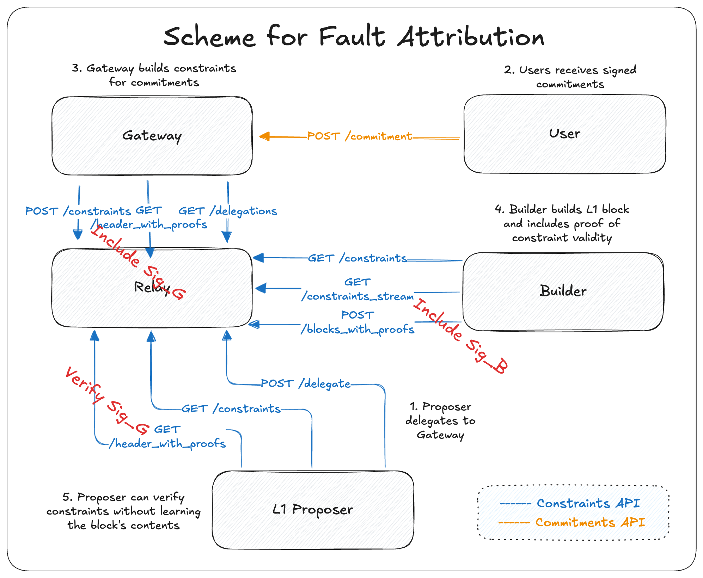
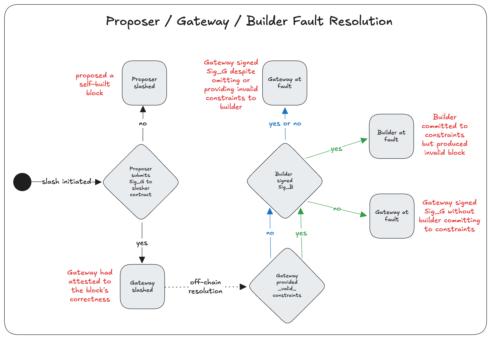

# Fault Attribution

## Table of Contents

## Introduction
This document outlines a recommended approach for handling fault attribution in proposer commitment protocols that adopt the Constraints API and the Universal Registry Contract (URC). As block production increasingly involves multiple parties (Gateways, Builders, Relays, and Proposers), some of which delegated, it becomes essential to clearly identify which actor is responsible in the event of a safety fault.

The goal of this proposal is not to redefine the core specifications of the Constraints API, but to offer a practical pattern for fault resolution that fits within the existing architecture. In particular, it provides a mechanism for distinguishing between proposer and gateway faults, enabling implementations to apply slashing with greater precision.

This approach reflects ongoing discussions across teams building Gateways, Relays, and preconf protocols, and is intended as a shared reference point for implementations.

*Adoption is entirely optional*. These recommendations are not prescriptive, and teams are encouraged to adapt or extend them based on their own risk models, trust assumptions, and goals.

## Background
The Constraints API was originally based off of a narrow, focused goal: to enable L1 inclusion preconfirmations issued directly by the L1 proposer. In this non-delegated model, the proposer created commitments and constraints themselves, retaining full visibility and enabling trustless verification via proofs against the block header.

Since then, the role of the Constraints API has expanded beyond simple inclusion preconfs to encompass generic proposer commitments. As a result, teams have increasingly leaned toward delegation as the default model, where Gateways act on behalf of the proposer to issue commitments and constraints.

While delegation helps reduce proposer sophistication, it introduces ambiguity in fault attribution. If a safety fault occurs, who is actually responsible? Should the proposer be slashed? The Gateway? Can we even tell?

This document assumes familiarity with the end-to-end block building flow, including how commitments and constraints are generated, disseminated, and enforced. For those details, readers should refer to the [proposer spec](proposer.md), [gateway spec](gateway.md), and [builder spec](builder.md).

## Problem
The original security model of the Constraints API assumes the proposer has complete visibility into all commitments and constraints they issue. This allows the proposer to verify that a Builder's block satisfies their constraints by checking proofs against the block header. In the non-delegated model, this verification is both trustless and sound.

However, this model breaks down under delegation, where a Gateway issues commitments and constraints on behalf of the proposer. In this case, the proposer may no longer have full knowledge of all commitments made, nor visibility into the complete set of constraints disseminated to Builders. Similarly, Builders may be unaware of constraints that were issued but not relayed to them.

The following example illustrates the failure case:

1.	The proposer delegates to a Gateway.
2.	The Gateway signs two commitments for L1 inclusion preconfirmations: `TX1` and `TX2`.
3.	The Gateway only posts the constraint for `TX1` to the Relay, withholding the constraint for `TX2`.
4.	The Builder receives the constraints, includes `TX1` in the block, and generates a valid Merkle inclusion proof.
5.	The proposer, unaware of the missing constraint, verifies the proof and proposes the block.
6.	The proposer is slashed for omitting `TX2`, despite acting honestly and according to protocol.

This reveals a critical flaw: in the delegated setting, valid proofs can still be unsound if the Gateway selectively withholds constraints. Builders cannot be held accountable if they never receive all relevant constraints, and proposers are exposed to slashing despite having no way to detect the omission.

As a result, proofs no longer offer trustless guarantees. Their soundness becomes entirely dependent on the honesty and completeness of the Gateway. This erodes the foundational security model of the protocol and highlights the need for a revised approach to fault attribution.

## Proposed Solution
To resolve the ambiguity introduced by delegation, we propose a fault attribution mechanism based on mutually attesting signatures between Builders and Gateways. This approach preserves the current Constraints API spec, introduces minimal latency, and enables slashing decisions to be made with clear attribution.

### Overview
The core idea is simple: instead of relying on the proposer to verify constraint proofs directly, we rely on a chain of attestations, Builder to Gateway and Gateway to Proposer, where each actor signs off on the block only if they believe all relevant constraints were satisfied. This moves the burden of verification and accountability onto the parties who actually have visibility into the constraints.

The flow is as follows:
1.	Gateway disseminates `SignedConstraints` objects
2.	Builder constructs a block that satisfies all the constraints they received. In the `VersionedSubmitBlockRequestWithProofs.proofs` field, the Builder includes their signature over the `SignedContraints` object, effectively attesting that the block complies with the constraints they were given.
3.	Gateway verifies the Builder's signature in the `SignedBuilderBidWithProofs.proof`. If the signature is valid over the `SignedConstraints`, the Gateway will sign the header with their BLS private key.
4.	Proposer receives the Gateway-signed header and proposes the block, verifying only that the signature matches their delegated Gateway.

This scheme ensures:
- If the Gateway never submitted a constraint, they can be held responsible.
- Builder are accountable if they sign off `SignedConstraints` and then produce invalid an block.
- If the Proposer self-builds or ignores the Gateway signature, they can be held responsible.

### Slashing

The above flow chart documents how to resolve faults and implement slashers. Today, Builders post off-chain collateral to participate in the PBS supply chain, which we leverage to align incentives.

We start off assuming a safety fault has occurred and on-chain slashing has been initiated. The Slasher contract should initiate a challenge window.
1. The proposer cannot submit a Gateway signature within the challenge window, so they are slashed.
2. The proposer submits a Gateway signature within the challenge window vindicating themself. The fault is either due to the Gateway or the builder:

| Gateway disseminated valid `SignedConstraints` | Builder signed `SignedConstraints` | Gateway signed header | Result                        | Remarks                                                      |
|---------------------------------------------|----------------------------------|------------------------|-------------------------------|--------------------------------------------------------------|
| no                                          | no                               | no                     | Proposer doesn’t propose block | Proposer shouldn’t propose unless valid Gateway signature     |
| no                                          | no                               | yes                    | Gateway slashed               | Builder didn’t sign                                           |
| no                                          | yes                              | no                     | Proposer doesn’t propose block | Proposer shouldn’t propose unless valid Gateway signature     |
| no                                          | yes                              | yes                    | Gateway slashed               | Builder was honest but constraints are missing or invalid     |
| yes                                         | no                               | no                     | Proposer doesn’t propose block | Proposer shouldn’t propose unless valid Gateway signature     |
| yes                                         | no                               | yes                    | Gateway slashed               | Builder didn’t commit to following constraints but Gateway still approved the block |
| yes                                         | yes                              | no                     | Proposer doesn’t propose block | Proposer shouldn’t propose unless valid Gateway signature     |
| yes                                         | yes                              | yes                    | Builder slashed               | The constraints were valid but the Builder’s block failed to satisfy them |

This incentives the following honest behavior:
- Builders are incentivized to build blocks that comply to the `SignedConstraints` they sign over.
- Gateways are incentivized to disemminate truthful and complete `SignedConstraints`, and only sign headers if they see it's bound to the `SignedConstraints` they issued.  
- Proposers are incentivized to only sign headers that have been signed off by their delegated Gateways.

### Properties
- No changes to the core spec are required if the Gateway reuses the existing `get_header_with_proofs` endpoint to supply its signature.
- No need for proof generation on the Builder side or proof verification on the Proposer side, only signature checks.
- Even if Gateway, Builder, and Relay roles are collapsed into a single actor, they remain individually accountable due to the attestation chain.
- An additional communication hop is from Relay to Gateway is needed for the Gateway signature, but in practice this may be offset by the latency reduction from removing proof generation from the critical path.
